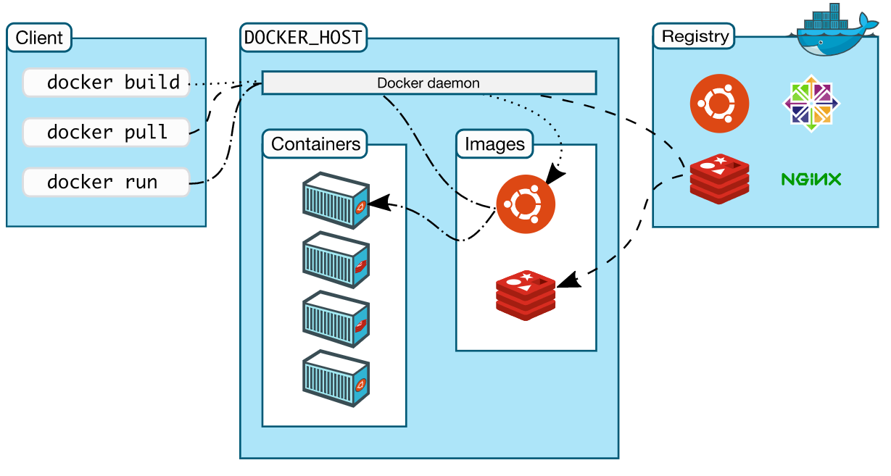

# Docker

Docker 提供了在松散隔离的环境（称为容器）中打包和运行应用程序的功能。Docker 使用 Docker Engine 将 `物理硬件` 与 `应用程序` 进行隔离。

## Docker Engine （Docker 引擎）

Docker Engine 包括以下主要组件：

- Docker 守护进程（dockerd \<docker daemon\>）。
- REST API 指定程序与守护进程进行通信的操作接口。
- CLI 命令行 （一系列 docker 命令）。

> Docker CLI 使用 REST API 通过 CLI 命令来去控制 Docker 守护进程进行交互。许多其他的 Docker 应用程序都是用基础的 API 和 CLI。守护进程创建和管理 Docker 对象。例如：images (镜像)，containers (容器)，network（网络），data valumes (数据卷)。


## Docker Architecture （Docker 架构）

Docker 是 Client-Server (客户端-服务端 \< CS \>) 服务架构。客户端与 Docker 守护进程（服务端）进行对话，守护进程完成构建，运行和分发 Docker 容器的繁重工作。Docker 客户端和守护进程在 UINX 套接字或者网络接口上使用 REST API 进行通信。



## Docker 的架构和底层技术

Docker 使用 GO 语言编写的，并利用 Linux 内核的多个功能来进行交付。

### namespace (命名空间)

使用 namespace 的技术，为工作区的容器进行隔离。运行容器时，Docker 会为该容器创建一组 namespace。 且该命名空间提供了一层隔离。容器的每个方面都在单独的命名空间中运行。并且访问仅限于该命名空间。

- pid：进程隔离。（进程 ID）
- net：网络接口。
- ipc：访问 ipc（Inter-Process Communication） 资源 （进程间通信）
- mnt：文件系统挂载点
- uts：隔离内核和版本标志符 （UTS：UINX 时间共享系统）

### Control Groups （控制组）

cgroups 将应用程序限制为一组特定的资源。Control Groups 允许 Docker 引擎将可用的硬件资源共享给容器，并有选择的进行实施限制和约束。例如：限定特定容器的可用内存。

### Union file systems （联合文件系统）

使用 UnionFS 可以快速轻便的进行创建 images，对 containers 和 images 进行分层。

## What is a container? (什么是容器)

容器就像是运行在机器上的所有其他进程隔离的另一个进程。这种隔离就是利用了内核的namespace （命名空间） 和 Control Groups (控制组)。

## What is a container image？( 什么是容器镜像)

当运行一个容器时它是的是一个独立的文件系统。而这个独立的文件系统则是由 容器 images （镜像）提供的。由于镜像包含容器的文件系统，因此必须包含运行应用程序所需的所有内容 ——> 依赖项、脚本、配置、二进制文件、环境变量、元数据以及运行的命令等。

## 安装 Docker

详细见官网，这里只阐述做国内的docker-ce yum 源

```bash
 yum-config-manager --add-repo https://mirrors.aliyun.com/docker-ce/linux/centos/docker-ce.repo

sudo sed -i 's/download.docker.com/mirrors.aliyun.com\/docker-ce/g' /etc/yum.repos.d/docker-ce.repo

yum makecache
```

### 配置加速

如果该命令有输出，那么请执行 systemctl cat docker 查看 ExecStart= 出现的位置，修改对应的文件内容去掉 --registry-mirror 参数及其值，并按接下来的步骤进行配置。

```bash
systemctl cat docker | grep '\-\-registry\-mirror'
```

如果以上命令没有任何输出，那么就可以在 /etc/docker/daemon.json 中写入如下内容（如果文件不存在请新建该文件）：

```bash
{
  "registry-mirrors": [
    "https://hub-mirror.c.163.com",
    "https://mirror.baidubce.com"
  ]
}

```

> 注意，一定要保证该文件符合 json 规范，否则 Docker 将不能启动。

重启服务

```bash
sudo systemctl daemon-reload
sudo systemctl restart docker
```

### 检查加速器是否生效

```bash
# 如果从结果中看到之前配置的加速器地址，说明配置成功
docker info
```

### 测试

```bash
docker run hello-world
```
